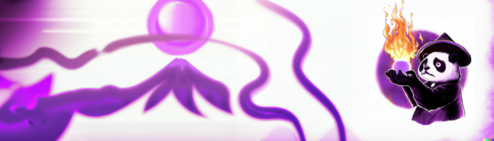

<i>Generated with DALL.E2</i>

# 👋🏼 Quick Presentation

Hi, I’m @chloedia, but my real name is Chloé Daems ! I’m interested in machine and deep learning applied to image, Natural Language Processing and Reinforcement learning. 
In my GitHub, you can find some of my university project and personal ones I work on my free time. I just finished my engineering degree at CentralSupélec and am currently working on RL research with CNRS.

I am passionate about technology, travels and art ! 

  
# 💡 Projects

 

# ✉️ Contact

	
	&nbsp;
	

 

